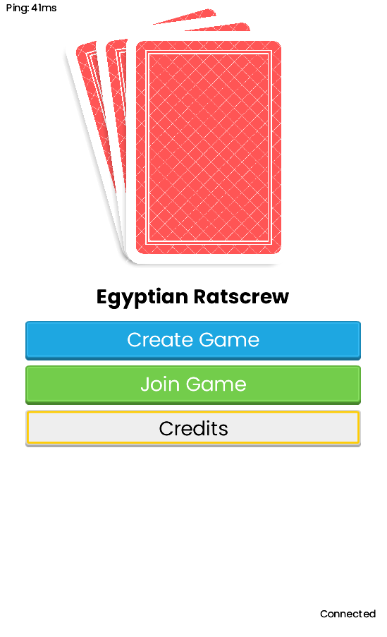
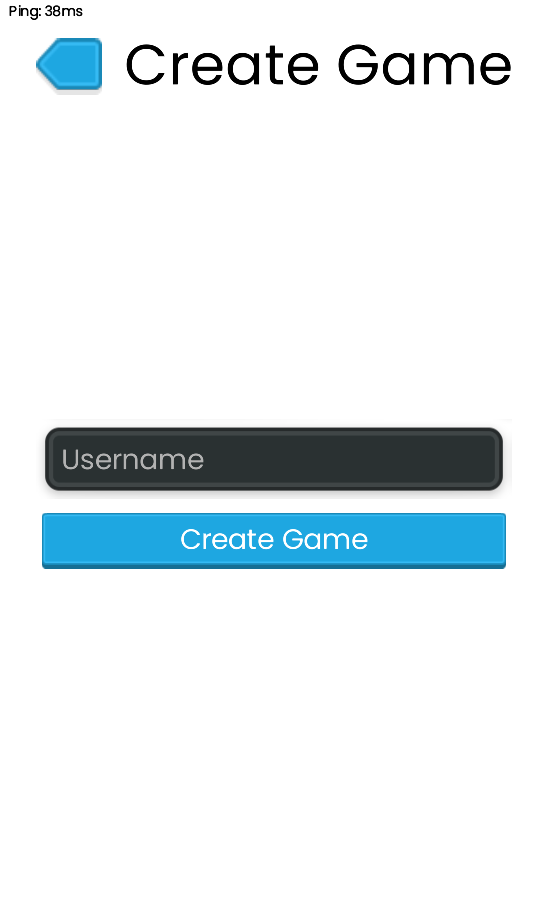
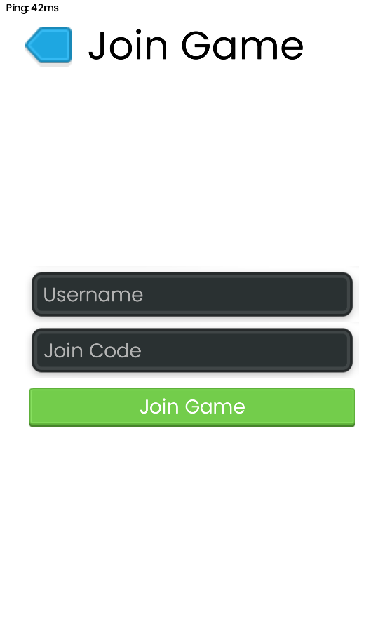
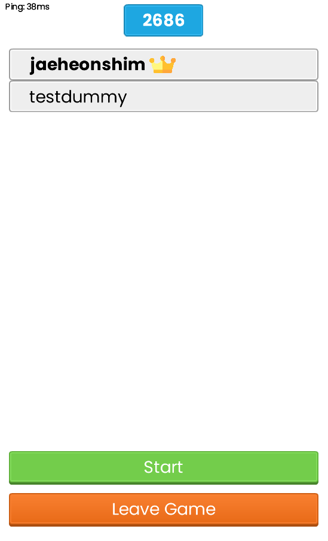
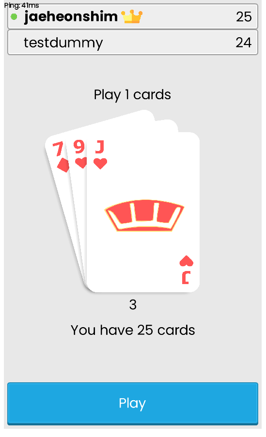

# ERSGame
This repository contains a small project that I built in my free time. It is the card game [ERS](https://bicyclecards.com/how-to-play/egyptian-rat-screw/), recreated as a digital game.

You can play the game at https://ers.jaeheonshim.dev if you'd like. The experience is best with 2+ players.

## Code
Platform dependent code is located in the specific directories (android, desktop, ios). Core game code is located in the "core" folder. Headless code to be deployed on a server is located in "server".
The game is built on LibGDX, and uses websockets to communicate between the server and the client.

## Open Source Libraries
https://github.com/libgdx/libgdx  
https://github.com/TooTallNate/Java-WebSocket   
https://github.com/MrStahlfelge/gdx-websockets

Thanks to the authors and contributors behind these projects!

## Contributions
Feedback would be appreciated, but I won't be accepting code contributions to this project.

## Screenshots

